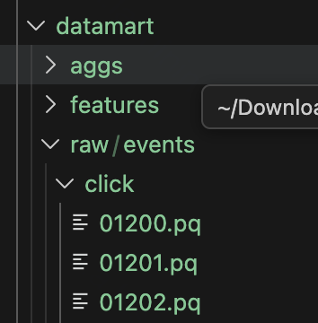
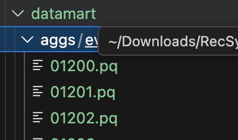
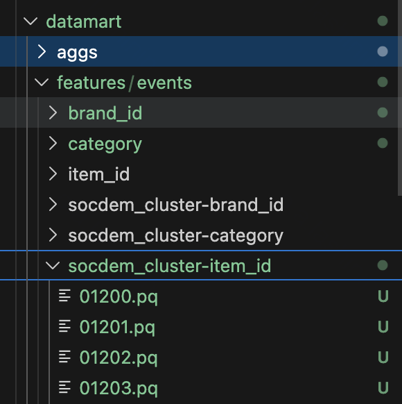

# Ранжирование рекомендаций на основе datamart

Подробный отчет по ноутбуку [ranking.ipynb](ranking.ipynb). В работе построен приближенный к реальному пайплайн рекомендательной системы для marketplace-данных из датасета [T-ECD](https://huggingface.co/datasets/t-tech/T-ECD). Фокус проекта - не retrieval и не бизнес-правила поверх выдачи, а второй этап многостадийной рекомендательной системы: ранжирование уже отобранных кандидатов.

Обычно промышленная рекомендательная система состоит из нескольких этапов:

1. Отбор кандидатов, или retrieval.
2. Ранжирование, или ranking.
3. Бизнес-логика поверх выдачи, например ограничения на подряд идущие товары одного продавца.

В идеале можно было бы ранжировать весь каталог под каждого пользователя, но каталог обычно намного больше итоговой выдачи, которую пользователь увидит. Качественно ранжировать весь каталог дорого по времени и ресурсам, поэтому используется компромисс: сначала быстрый retrieval отбирает релевантных кандидатов, а затем более тяжелая модель ранжирует только это подмножество.

## Краткий результат

В ноутбуке собран полный ranking-пайплайн:

- загружены marketplace-данные T-ECD;
- выбран вычислительно подъемный срез: 20 000 самых активных пользователей и 20 000 самых популярных товаров;
- построен трехслойный datamart: `raw`, `aggs`, `features`;
- собран обучающий датасет с 2 098 колонками, включая 2 094 признака;
- реализованы метрики `NDCG@k`, `HitRate@k`, `Recall@k` для `k = 1, 5, 10, 20, 50`;
- построен TopPopular-бейзлайн;
- обучены и сравнены LightGBM Ranker, LightGBM Regressor, CatBoost Ranker и CatBoost Regressor;
- лучший выбранный по валидации ранкер побил бейзлайн на тесте.

Ключевое сравнение на тесте:

| Модель | NDCG@5 | HitRate@5 | Recall@5 |
| --- | ---: | ---: | ---: |
| TopPopular baseline | 0.41077 | 0.75155 | 0.51620 |
| LGBM Ranker, выбранный итоговый ранкер | 0.44124 | 0.79020 | 0.54951 |
| LGBM Regressor | 0.44323 | 0.78261 | 0.54477 |
| CatBoost Ranker | 0.43825 | 0.78123 | 0.54151 |
| CatBoost Regressor | 0.43451 | 0.76329 | 0.53158 |

Итоговый ранкер улучшил TopPopular по `NDCG@5` с `0.41077` до `0.44124`, по `HitRate@5` с `0.75155` до `0.79020`, по `Recall@5` с `0.51620` до `0.54951`. На самом тестовом срезе `LGBMRegressor` дал немного более высокий `NDCG@5 = 0.44323`, но модель для итогового сравнения выбиралась по валидации, где лучшим был `LGBMRanker`.

## Состав репозитория

```text
.
├── ranking.ipynb
├── images/
│   ├── datamart_raw.png
│   ├── datamart_agg.png
│   └── datamart_feat2.png
├── LICENSE
└── README.md
```

После запуска ноутбука дополнительно создаются тяжелые локальные артефакты, которые не входят в репозиторий:

```text
dataset/
datamart/
├── raw/
├── aggs/
└── features/
output/
├── basis/
├── dataset/
└── feature_sparsity/
```

## Данные

Источник данных: `t-tech/T-ECD`, small-срез marketplace.

В ноутбуке скачиваются:

- `dataset/small/users.pq`;
- `dataset/small/marketplace/**`.

Данные занимают около `3.5 GB`. Самая тяжелая часть - эмбеддинги товаров. В ноутбуке отмечено, что для этой работы эмбеддинги удалялись из `items.pq`, потому что место нужно было под построение датамарта. Основной пайплайн ранжирования в итоге опирается на агрегатные, товарные, пользовательские и категориальные признаки, а не на item embeddings.

Используемый срез:

| Параметр | Значение |
| --- | ---: |
| Дни | `1250..1300`, всего 51 день |
| Пользователи | топ-20 000 по числу событий |
| Товары | топ-20 000 по числу событий |
| Таблица пользователей | `(20000, 3)` |
| Таблица товаров | `(20000, 5)` |

Типы событий:

| Событие | Label | Смысл в ранжировании |
| --- | ---: | --- |
| `view` | 0 | просмотр |
| `click` | 1 | клик |
| `clickout` | 2 | переход наружу |
| `like` | 3 | лайк |

В работе используется бизнес-порядок:

```text
view < click < clickout < like
```

Поверхности, или `subdomain`:

```text
u2i, i2i, catalog, search, other
```

## Воспроизведение

Проект сделан как исследовательский ноутбук. Базовый сценарий запуска:

```powershell
python -m venv .venv
.\.venv\Scripts\activate
pip install -q polars lightgbm scikit-learn catboost shap optuna implicit torch huggingface_hub pandas numpy matplotlib scipy tqdm joblib jupyter
jupyter notebook ranking.ipynb
```

В ноутбуке данные скачиваются через `huggingface_hub.snapshot_download`:

```python
snapshot_download(
    repo_id="t-tech/T-ECD",
    repo_type="dataset",
    local_dir=".",
    local_dir_use_symlinks=False,
    allow_patterns=[
        "dataset/small/users.pq",
        "dataset/small/marketplace/**",
    ],
)
```

Примечание: `local_dir_use_symlinks` уже помечен как deprecated в `huggingface_hub`; в выводе ноутбука было предупреждение, что этот аргумент игнорируется.

## Архитектура datamart

В ноутбуке используется подход с витриной данных под задачу ранжирования. Каждый слой хранится на диске и пересчитывается по дням. Это приближает работу к реальному сервисному пайплайну, где фичи не пересчитываются с нуля при каждом обучении модели.

### Raw слой



Raw слой содержит отфильтрованные сырые события за конкретную дату. Данные раскладываются в двух представлениях:

```text
datamart/raw/events/{action_type}/{day}.pq
datamart/raw/subdomains/{subdomain}/{day}.pq
```

Пример:

```text
datamart/raw/events/view/01250.pq
datamart/raw/events/click/01250.pq
datamart/raw/subdomains/search/01250.pq
```

По логам выполнения, raw слой был построен для 51 дня. Отдельные проходы по `action_type` и `subdomain` занимали около 2 секунд каждый на локальной машине.

### Agg слой



Agg слой агрегирует события внутри дня по парам:

```text
(user_id, item_id)
```

Для каждой пары считаются:

- количество событий каждого `action_type`;
- количество событий каждого `action_type` на каждой поверхности `subdomain`;
- общий счетчик по всем поверхностям.

Путь сохранения:

```text
datamart/aggs/events/{day}.pq
```

В ноутбуке пример агрегации за день `01300` имел форму:

```text
shape: (10, 26)
```

Это соответствует ключам `user_id`, `item_id` и 24 счетчикам: `4 action_type * (5 subdomains + all_subdomains)`.

### Feature слой



Feature слой строится поверх агрегатов. Все признаки считаются в временных окнах:

```text
7d, 14d, 30d
```

Основные группы признаков:

```text
brand_id
category
item_id
socdem_cluster-brand_id
socdem_cluster-category
socdem_cluster-item_id
user_id
user_id-brand_id
user_id-category
user_id-item_id
```

Путь сохранения:

```text
datamart/features/events/{feature_group}/{day}.pq
```

Примеры форм таблиц из ноутбука:

| Feature group | Пример формы |
| --- | --- |
| `user_id` | `(10, 145)` |
| `item_id` | `(10, 253)` |
| `user_id-item_id` | `(10, 146)` |
| `socdem_cluster-brand_id` | `(10, 254)` |

В feature engineering использовались:

- счетчики событий: просмотры, клики, кликауты, лайки;
- счетчики по поверхностям: `u2i`, `i2i`, `catalog`, `search`, `other`;
- медианная цена товаров, с которыми взаимодействовали пользователи или группы;
- конверсии между событиями;
- доли событий внутри группы;
- базовые категориальные признаки пользователя и товара.

Пары для конверсий:

```text
view -> click
view -> clickout
view -> like
click -> clickout
click -> like
clickout -> like
```

Для конверсий отдельно обработано деление на ноль: если знаменатель не определен или равен нулю, значение признака становится `null`.

Именование признаков унифицировано:

```text
f_num__{keys}__{feature}
f_cat__{feature}
```

Примеры:

```text
f_num__user_id__num_view_30d
f_num__item_id__share_like_from_search_14d
f_num__user_id_item_id__median_price_click_7d
f_cat__socdem_cluster
f_cat__brand_id
```

## Сбор обучающего датасета

Датасет собирается в два этапа:

1. Сбор базиса, или "скелета" кандидатов.
2. Присоединение признаков к базису.

### Базис

Базис имеет структуру:

```text
(session_id, user_id, item_id, label)
```

`session_id` строится как конкатенация `user_id` и `day`. Это значит, что в рамках работы модель ранжирует товары, показанные пользователю в течение одного дня.

Правила сборки:

- `label` задается по типу события: `view=0`, `click=1`, `clickout=2`, `like=3`;
- если в рамках одной сессии у пользователя было несколько взаимодействий с одним товаром, берется максимальный `label`;
- сессии, целиком состоящие только из `view`, удаляются, потому что по одинаковым нулевым целям сложно оценивать качество сортировки;
- добавлена фильтрация сессий по 99-му перцентилю длины, чтобы отсечь слишком длинные сессии.

Статистика базиса:

| Поле | Уникальных значений |
| --- | ---: |
| `session_id` | 58 929 |
| `user_id` | 18 554 |
| `item_id` | 19 994 |
| `label` | 4 |

Распределение `label`:

| Label | Событие | Количество |
| ---: | --- | ---: |
| 0 | `view` | 1 819 654 |
| 1 | `click` | 147 205 |
| 2 | `clickout` | 26 243 |
| 3 | `like` | 2 848 |

Статистика длины сессии после фильтрации:

| Метрика | Значение |
| --- | ---: |
| count | 58 929 |
| mean | 33.87042 |
| std | 34.702187 |
| min | 1 |
| 25% | 10 |
| 50% | 23 |
| 75% | 45 |
| max | 238 |

### Join признаков

При сборке итогового датасета признаки берутся за предыдущий день, чтобы избежать утечки:

```text
dataset day = 1300
feature day = 1299
```

К базису присоединяются:

- признаки пользователя из `users.pq`: `socdem_cluster`, `region`;
- признаки товара из `items.pq`: `brand_id`, `category`, `subcategory`, `price`;
- признаки из всех доступных feature-group директорий;
- опционально список выбранных фичей из файла.

Итоговый датасет сохраняется по дням:

```text
output/dataset/{day}.pq
```

Пример формы дневного файла:

```text
shape: (10, 2_098)
```

Итоговое число признаков:

| Тип | Количество |
| --- | ---: |
| Все `f_` признаки | 2 094 |
| Числовые | 2 089 |
| Категориальные | 5 |
| Всего колонок в датасете с id и target | 2 098 |

Разбиение для обучения и оценки:

| Часть | Дни |
| --- | --- |
| Train | `1265..1278`, 14 дней |
| Validation | `1279`, 1 день |
| Train + Validation | `1265..1279`, 15 дней |
| Test | `1280`, 1 день |

Формы отображенных выборок:

| Выборка | Форма |
| --- | --- |
| `train_val_df` | `(623514, 2098)` |
| `test_df` | `(37568, 2098)` |

В тестовой выборке было `1449` уникальных пользователей.

## Метрики

Метрики считаются по структуре:

```text
session_id -> preds: [(item_id, score)], targets: [(item_id, label)]
```

Реализованы:

- `NDCG@k`: основная метрика качества ранжирования;
- `HitRate@k`: есть ли хотя бы один релевантный товар в топ-k;
- `Recall@k`: какая доля релевантных товаров попала в топ-k.

Использованные `k`:

```text
1, 5, 10, 20, 50
```

В A/A sanity check сортировка по истинному `label` дает "best", обратный порядок дает "worst":

| Сценарий | NDCG@5 | HitRate@5 | Recall@5 | NDCG@10 | Recall@10 |
| --- | ---: | ---: | ---: | ---: | ---: |
| best | 1.00000 | 1.00000 | 0.96632 | 1.00000 | 0.99526 |
| worst | 0.15606 | 0.22291 | 0.20925 | 0.22145 | 0.38701 |

## TopPopular baseline

Бейзлайн обучается на положительных взаимодействиях из train-части. Для каждого товара считается популярность:

```text
score = sum(label) + num_positive_interactions * 1e-6
```

Малая добавка по числу положительных взаимодействий помогает детерминированно разделять близкие товары. При оценке внутри сессии кандидаты дополнительно перемешиваются перед сортировкой, чтобы одинаковые `score` не наследовали случайно удачный исходный порядок.

Результаты TopPopular:

| Split | NDCG@1 | NDCG@5 | HitRate@5 | Recall@5 | NDCG@10 | Recall@10 | NDCG@50 | Recall@50 |
| --- | ---: | ---: | ---: | ---: | ---: | ---: | ---: | ---: |
| Validation | 0.247487 | 0.366961 | 0.721636 | 0.463267 | 0.451772 | 0.680438 | 0.542895 | 0.963087 |
| Test | 0.26761 | 0.41077 | 0.75155 | 0.51620 | 0.49202 | 0.72414 | 0.57098 | 0.97057 |

Вывод из ноутбука: бейзлайн работает корректно, качество выше worst-сценария, а на тесте получилось лучше, чем на валидации. Идеального ранжирования нет, но результат хорошо подходит как нижняя точка сравнения для персонализированного ранкера.

## Отбор признаков

После join-а получилось очень много признаков, поэтому перед обучением была сделана проверка разреженности. Для числовых фичей считалась доля `null` или нулевых значений, для всех фичей дополнительно считался `n_unique`.

Отчеты сохранены ноутбуком в:

```text
output/feature_sparsity/feature_sparsity_report.csv
output/feature_sparsity/feature_sparsity_threshold_summary.csv
```

Проверенные пороги:

| Threshold | Kept features | Kept numeric | Kept categorical | Dropped | Kept share |
| ---: | ---: | ---: | ---: | ---: | ---: |
| 0.900 | 1 199 | 1 194 | 5 | 895 | 0.572588 |
| 0.950 | 1 278 | 1 273 | 5 | 816 | 0.610315 |
| 0.970 | 1 336 | 1 331 | 5 | 758 | 0.638013 |
| 0.980 | 1 354 | 1 349 | 5 | 740 | 0.646609 |
| 0.990 | 1 406 | 1 401 | 5 | 688 | 0.671442 |
| 0.995 | 1 448 | 1 443 | 5 | 646 | 0.691500 |

В работе выбран порог `0.99`: фича удаляется, если доля пропусков или нулей больше `0.99`, либо если `n_unique <= 1`. Такой порог сохраняет большую часть потенциально полезной информации, но убирает совсем непригодные или почти всегда пустые признаки.

Итог после фильтрации:

| Параметр | Значение |
| --- | ---: |
| Всего признаков до фильтрации | 2 094 |
| Признаков после фильтрации | 1 406 |
| Числовых после фильтрации | 1 401 |
| Категориальных после фильтрации | 5 |
| Удалено | 688 |

## Обучение бустингов

В ноутбуке реализованы четыре постановки:

| Модель | Постановка | Loss/objective |
| --- | --- | --- |
| `lgbm_ranker` | ранжирование | `lambdarank` |
| `lgbm_regressor` | регрессия по label | `regression` |
| `catboost_ranker` | ранжирование | `YetiRank` |
| `catboost_regressor` | регрессия по label | `RMSE` |

Для LightGBM Ranker гиперпараметры подбирались через Optuna `TPESampler(seed=42)` на `val`, оптимизировался `NDCG@5`. Было запущено 5 trial. Лучший trial:

| Параметр | Значение |
| --- | ---: |
| `n_estimators` | 139 |
| `learning_rate` | 0.031995373905230294 |
| `num_leaves` | 89 |
| `min_child_samples` | 37 |
| `subsample` | 0.7195154778955838 |
| `colsample_bytree` | 0.984665661176 |
| `reg_lambda` | 7.886714129990489 |
| Best validation `NDCG@5` | 0.4095026516570856 |

История Optuna:

| Trial | NDCG@5 | n_estimators | learning_rate | num_leaves | min_child_samples | subsample | colsample_bytree | reg_lambda |
| ---: | ---: | ---: | ---: | ---: | ---: | ---: | ---: | ---: |
| 0 | 0.391274 | 117 | 0.112075 | 102 | 80 | 0.746806 | 0.746798 | 0.014937 |
| 1 | 0.402277 | 167 | 0.069029 | 99 | 22 | 0.990973 | 0.949733 | 0.043353 |
| 2 | 0.408643 | 98 | 0.038685 | 60 | 73 | 0.829584 | 0.787369 | 0.684792 |
| 3 | 0.407440 | 94 | 0.044979 | 66 | 66 | 0.935553 | 0.759902 | 0.348902 |
| 4 | 0.409503 | 139 | 0.031995 | 89 | 37 | 0.719515 | 0.984666 | 7.886714 |

Для CatBoost параметры были согласованы с лучшим LGBM-прогоном:

| Параметр | Значение |
| --- | ---: |
| `iterations` | 139 |
| `learning_rate` | 0.031995 |
| `depth` | 6 |
| `l2_leaf_reg` | 7.886714 |

Полное обучение и проверка четырех моделей заняли около `15:04` по выводу ноутбука.

## Результаты моделей

### Валидация

| Модель | NDCG@1 | NDCG@5 | HitRate@5 | Recall@5 | NDCG@10 | Recall@10 | NDCG@50 | Recall@50 |
| --- | ---: | ---: | ---: | ---: | ---: | ---: | ---: | ---: |
| LGBM Ranker | 0.28788 | 0.40950 | 0.76979 | 0.50833 | 0.48699 | 0.70241 | 0.57398 | 0.96829 |
| LGBM Regressor | 0.28801 | 0.40550 | 0.76517 | 0.50166 | 0.48471 | 0.70430 | 0.57127 | 0.96952 |
| CatBoost Ranker | 0.28860 | 0.40720 | 0.76913 | 0.50449 | 0.48842 | 0.70709 | 0.57203 | 0.96419 |
| CatBoost Regressor | 0.28289 | 0.40010 | 0.75528 | 0.49363 | 0.48199 | 0.70316 | 0.56776 | 0.96756 |

По `NDCG@5` на валидации лучшим был `LGBM Ranker`, поэтому именно он выбран как итоговый ранкер для сравнения в `RESULTS`.

### Тест

| Модель | NDCG@1 | NDCG@5 | HitRate@5 | Recall@5 | NDCG@10 | Recall@10 | NDCG@50 | Recall@50 |
| --- | ---: | ---: | ---: | ---: | ---: | ---: | ---: | ---: |
| TopPopular baseline | 0.26761 | 0.41077 | 0.75155 | 0.51620 | 0.49202 | 0.72414 | 0.57098 | 0.97057 |
| LGBM Ranker | 0.30234 | 0.44124 | 0.79020 | 0.54951 | 0.52035 | 0.75023 | 0.59442 | 0.97868 |
| LGBM Regressor | 0.31638 | 0.44323 | 0.78261 | 0.54477 | 0.52163 | 0.74476 | 0.59850 | 0.98055 |
| CatBoost Ranker | 0.30109 | 0.43825 | 0.78123 | 0.54151 | 0.51708 | 0.74095 | 0.59298 | 0.97535 |
| CatBoost Regressor | 0.30632 | 0.43451 | 0.76329 | 0.53158 | 0.51584 | 0.74077 | 0.59258 | 0.97674 |

Финальное сравнение из ноутбука:

| Сценарий | NDCG@5 | HitRate@5 | Recall@5 | NDCG@10 | HitRate@10 | Recall@10 | NDCG@20 | Recall@20 |
| --- | ---: | ---: | ---: | ---: | ---: | ---: | ---: | ---: |
| best | 1.00000 | 1.00000 | 0.96632 | 1.00000 | 1.00000 | 0.99526 | 1.00000 | 0.99990 |
| worst | 0.15606 | 0.22291 | 0.20925 | 0.22145 | 0.40166 | 0.38701 | 0.27872 | 0.57031 |
| baseline | 0.41077 | 0.75155 | 0.51620 | 0.49202 | 0.91166 | 0.72414 | 0.54080 | 0.86941 |
| ranker | 0.44124 | 0.79020 | 0.54951 | 0.52035 | 0.92616 | 0.75023 | 0.56708 | 0.88636 |

## Основные выводы

1. TopPopular оказался сильным и корректным бейзлайном. Он заметно лучше worst-сценария и показывает хорошие значения на больших `k`, но не персонализирует выдачу.
2. Градиентный бустинг ожидаемо побил бейзлайн. Улучшение не драматическое, но устойчиво видно по `NDCG@5`, `HitRate@5`, `Recall@5` и метрикам на `k=10/20/50`.
3. Лучший по валидации вариант - `LGBMRanker`, оптимизированный под `lambdarank`. На тесте он поднял `NDCG@5` с `0.41077` до `0.44124`.
4. `LGBMRegressor` на тесте дал максимальный `NDCG@5 = 0.44323`, но на валидации уступил ранкеру. Поэтому его можно считать сильной альтернативой, но итоговый выбор в ноутбуке сделан консистентно по validation split.
5. CatBoost тоже обогнал бейзлайн: `NDCG@5 = 0.43825` для ranker и `0.43451` для regressor. При этом CatBoost обучался без отдельного полноценного тюнинга, с параметрами, согласованными с LGBM.
6. В датасете всего 5 категориальных признаков и основная масса признаков числовая и агрегатная. Поэтому преимущества CatBoost на категориальных данных здесь раскрылись не полностью.
7. Построение datamart оказалось полезным: фичи можно хранить по дням и группам сущностей, переиспользовать для разных моделей и избегать пересчета сырых логов при каждом эксперименте.

## Ограничения работы

- Использован сэмпл из 20 000 пользователей и 20 000 товаров, потому что полный датасет может быть computationally infeasible на локальной машине.
- Эмбеддинги товаров были удалены для экономии места и не участвовали в финальном ранжировании.
- Валидация и тест сделаны на коротких временных срезах: 1 день validation и 1 день test.
- Для CatBoost не выполнялся отдельный полноценный подбор гиперпараметров.
- Работа покрывает ranking-этап. Retrieval и бизнес-правила поверх выдачи не реализовывались.

## Что можно улучшить дальше

- Добавить отдельный retrieval-этап и оценивать весь двухстадийный пайплайн.
- Использовать несколько validation-срезов или rolling-window валидацию.
- Вернуть item embeddings как отдельные признаки или как источник retrieval-кандидатов.
- Полноценно потюнить CatBoost и сравнить больше постановок задачи.
- Добавить модельные объяснения через SHAP и анализ важности признаков.
- Упаковать ноутбучный код в переиспользуемые скрипты или пайплайн.

## Лицензия

Проект распространяется под лицензией MIT. См. [LICENSE](LICENSE).
